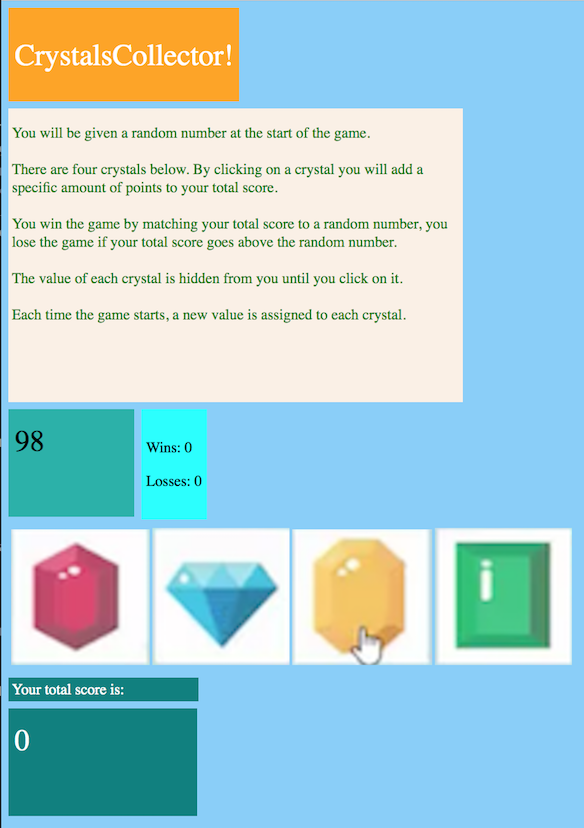

# utbc2019-hw-04-crystal-collector

This week I'm implementing "Crystals Collector", a simple number guessing game which updates the DOM dynamically using jQuery. Players click on crystals with associated values to accumulate a score with the goal of matching a random target value.

## Release 1.0 (MVP)

I'm really scraping by with the bare minimum on the user interface this time since I only had a few hours to knock this out, but the structure of the code behind the scenes is pretty clean and scalable.



The styling is brilliantly bad in a liberating way but it does match the specification, mostly. No effort is made toward responsiveness. Alert observers will notice I nabbed the artwork for the gems from a still image in the specification which happened to include a hand pointer on the yellow gem. This is now a kitchy fixture in my game since I didn't photoshop it out. :-)


## Implementation Features

- MVC software pattern.

- jQuery to update the DOM.

- The crystals are added on the fly and include frontend html elements with [data-index attributes](https://github.com/zenglenn42/utbc2019-hw-04-crystal-collector/blob/a761d1d944c2d4095fbc1df22fd73a90c5cf33e5/assets/js/controller.js#L41) which map to an [array of crystals](https://github.com/zenglenn42/utbc2019-hw-04-crystal-collector/blob/80264c7df74f09f6e9f9b9558a7bc3e8b2005451/assets/js/model.js#L39) owned by the game model on the backend. This enables crystal click events to trigger look-ups of the random value associated with a crystal object in the model and update the current score accordingly. Care is taken to bind event listeners at a document level so they can flow and find the dynamically added crystal elements that would otherwise be unknown to the DOM at load time.

```javascript
Controller.prototype.addCrystals = function() {
  for (let c of this.gameObj.crystals) {
    $(this.crystalParentId).append(
      `<a href="#" class="crystal" id="crystal-${c.index}" data-index="${
        c.index
      }"></a>`
    );
    $(document).on("click", `#crystal-${c.index}`, this.getCrystalCallback());
  }
};

Controller.prototype.getCrystalCallback = function() {
  let that = this;
  function crystalCallback(e) {
    let crystalIndex = parseInt($(this).attr("data-index"));
    that.takeTurn(crystalIndex);
  }
  return crystalCallback;
};
```

- Object oriented decomposition:

  - [Game](https://github.com/zenglenn42/utbc2019-hw-04-crystal-collector/blob/e98776d2cf56c8e5af537e9af54434f9aa04d603/assets/js/model.js#L4)

    - This knows about wins, losses, and scores.

  - [CrystalCollector Game](https://github.com/zenglenn42/utbc2019-hw-04-crystal-collector/blob/e98776d2cf56c8e5af537e9af54434f9aa04d603/assets/js/model.js#L38)

    - This inherits from Game and knows how to play the game and take a turn.

  - [Crystal](https://github.com/zenglenn42/utbc2019-hw-04-crystal-collector/blob/e98776d2cf56c8e5af537e9af54434f9aa04d603/assets/js/model.js#L113)

    - This associates a gem image with an object that can randomize a value. An array of these is owned by the CrystalCollector Game. Crystal values are randomized whenever the game's reset method is called (after a round of play).
    - Scalability note: Adding more crystals to the game is just a matter of editing [this image array](https://github.com/zenglenn42/utbc2019-hw-04-crystal-collector/blob/0989f987423afa20de16d676c50631a7e7696c15/assets/js/model.js#L47).

  - [Controller](https://github.com/zenglenn42/utbc2019-hw-04-crystal-collector/blob/e98776d2cf56c8e5af537e9af54434f9aa04d603/assets/js/controller.js#L7)
    - This mediates data flow between the user interface and game objects.

## Implementation Blockers

### Chrome's Live Evaluation of Objects

Surprisingly little integration debugging was required, but my world was rocked a bit during unit test of the CrystalCollector model. It looks like chrome's console performs a live evaluation of object content.

This threw me off because I would [newly instantiate the game object](https://github.com/zenglenn42/utbc2019-hw-04-crystal-collector/blob/541ed9b7b7ef42ae4a29acb54c766d87d8e0f471/assets/js/model.js#L141), dump it to the console, mutate the object, then console log again. But drilling down into both before-and-after objects within the inspector yielded only the /mutated/ object values in both cases!


(Notice the 'value: 10, 11, 9, 11' in both instances of CrystallCollector?!)

The lesson is that console log does not necessarily reflect an object's history of change over time. I need to dig into this more as I'm unsure if this relates more to the shared aspect of an object's prototype area across all instances versus some tooling behaviour unique to chrome's inspector.

Setting a breakpoint before mutation reassured me that the object did in fact transition from it's initial value to it's mutated value as desired.

### Hidden Superclass Method

Early on, during integration testing of the controller and the game model, I noticed the accumulated score was not resetting to 0 between rounds of play. I could have sworn I'd taken care to do that somewhere, and sure enough, here it was:

```javascript
Game.prototype.reset = function() {
  this.score = 0;
  this.state = "playing";
};
```

However, since I'd subclassed the CrystalController object from Game, I had overridden the reset method with something that only knew about re-randomizing crystals (and not resetting the score and state):

```javascript
CrystalCollector.prototype.reset = function() {
  for (let index in this.crystals) {
    this.crystals[index].reset();
  }
  this.targetValue = this.getRandomValue();
};
```

I naively assumed the super class' reset method would get magically called behind the scenes. This did not happen. Not being terribly familiar with inheritance in javascript, I opted to recreate the contents of the super class' reset in the overriding method:

```javascript
CrystalCollector.prototype.reset = function() {
  this.score = 0; // :-|  Works, but I'm duplicating code.
  this.state = "playing"; // :-|
  for (let index in this.crystals) {
    this.crystals[index].reset();
  }
  this.targetValue = this.getRandomValue();
};
```

This works, however, the code duplication rankles me since I /know/ other languages have idioms for invoking a super class method from the subclass. It turns out javascript has a couple options here depending upon a traditional style or a more modern ES6 style.

Apparently, I'm using a more traditional style of inheritance which I glommed onto from Marc Wandschneider's book, "Learning Node.js", published in 2017. In that style, it would be better to do this:

```javascript
CrystalCollector.prototype.reset = function() {
  Game.prototype.reset.call(this); // :-) call superclass reset() method
  for (let index in this.crystals) {
    this.crystals[index].reset();
  }
  this.targetValue = this.getRandomValue();
};
```

The more modern (ES6) syntax replaces the verbose call to Game.prototype.reset.call(this) with:

```javascript
super.reset();
```

That seems enough of a cognitive win to abandon traditional syntax altogether. I haven't decided which camp I'm in yet. I'll play with both styles.

I sense factions within the JS community itself with some aligning with tradition since it is more obvious what is actually going on behind the scenes. JS luminaries like Douglas Crockford, author of "JavaScript: The Good Parts", seems to eschew more modern syntactic sugar that would seek to make JS's prototypal inheritance (where objects inherit from other objects) look 'pseudo classical' in the surface style of java's class-based inheritance. He actually argues that prototype inheritance is more expressive than java's flavor and should not be slathered over with java-like syntax out of a lack of confidence.

Personally, I suspect once I have the low-level fundamentals down, I'll enjoy the cleaner syntax of ES6 inheritance.
